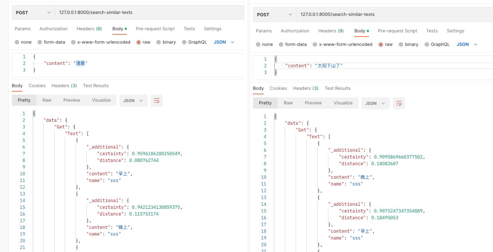
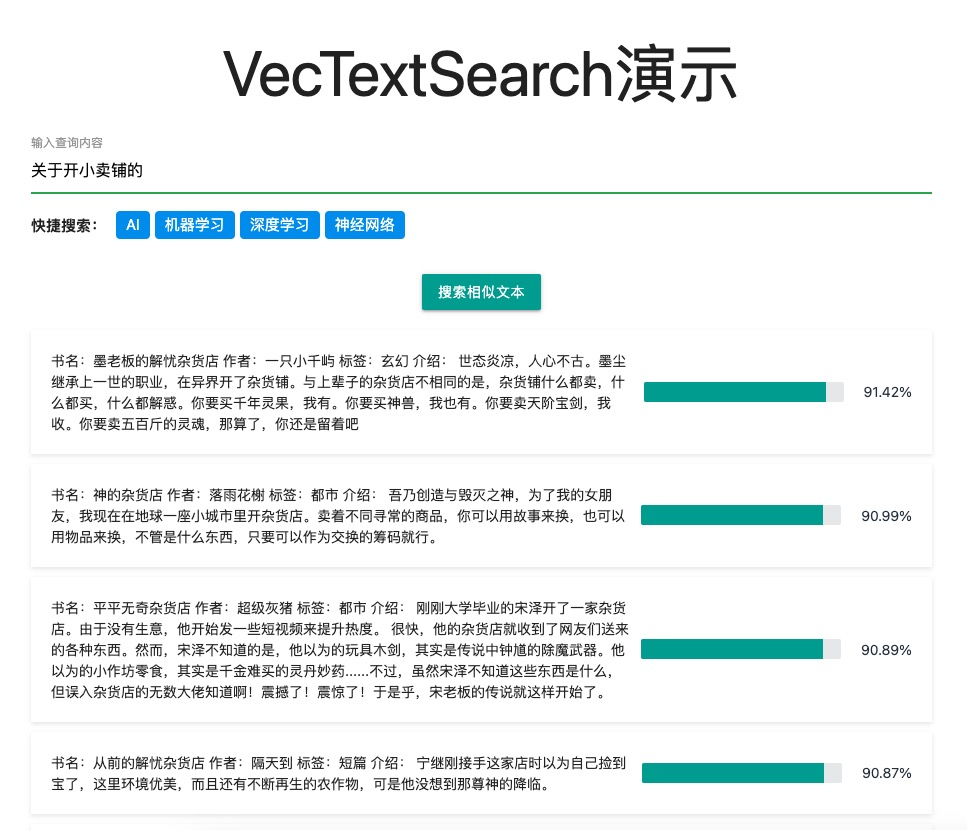
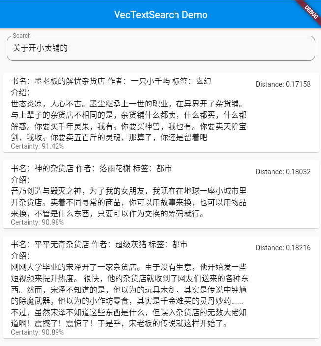

# VecTextSearch

[](https://github.com/szpnygo/VecTextSearch)


VecTextSearch是一个使用OpenAI语言模型生成文本向量并在Weaviate数据库中进行高效搜索的项目。它允许用户将文本数据存储在Weaviate数据库中，并根据文本相似性快速搜索和检索相关文本。项目使用Golang编写，并提供一个简单的REST API供客户端调用


简体中文 | [English](README_en.md)

## 项目介绍
VecTextSearch 是一个使用 OpenAI 语言模型生成文本向量并在 Weaviate 数据库中进行高效搜索的项目。它允许用户将文本数据存储在 Weaviate 数据库中，并根据文本相似性快速搜索和检索相关文本。项目使用 Golang 编写，并提供一个简单的 REST API 供客户端调用。

## 聊天记录
[聊天记录1](history/chat1.md) - 创建项目

[聊天记录2](history/chat2.md) - 修改Dockerfile和Makefile

[聊天记录3](history/chat3.md) - 简化向量搜索的返回结果，修改数据结构

[聊天记录4](history/chat4.md) - 重构项目结构

[聊天记录5](history/chat5.md) - 把ChatGPT的聊天对话直接下载为Markdown文件

[聊天记录6](history/chat6.md) - 添加跨域支持，修复make run命令的错误

[聊天记录7](history/chat7.md) - 修复文档错误

[聊天记录8](history/chat8.md) - 添加文本的时候配置内容是否可以重复

[聊天记录9](history/chat9.md) - weaviate的className可配置

## 效果

### postman


### web


### flutter


## 项目背景
在许多实际应用中，需要基于文本相似性进行快速搜索。例如，给定一篇文章，可以找到与其内容相似的其他文章。传统的基于关键词的搜索方法可能无法准确捕捉到文本之间的相似性。VecTextSearch 利用 OpenAI 的强大语言模型将文本转换为向量表示，然后使用 Weaviate 数据库进行高效的相似向量搜索。

## 用处与使用场景
VecTextSearch 可以应用于以下场景：

- 为文章、博客、论文等寻找相关内容。
- 实现智能问答系统，根据用户提问快速匹配到相关问题及答案。
- 构建推荐系统，根据用户的阅读历史为其推荐相似文章。
- 检测重复或抄袭的内容。

## TODO 列表

- [ ] **开发演示应用程序**：创建一个用于直观展示 VecTextSearch 功能和用例的演示应用程序。
- [ ] **添加数据管理接口**：为项目提供数据管理接口，方便用户管理存储在 Weaviate 数据库中的文本数据。
- [ ] **开发用户友好的前端界面**：简化 VecTextSearch 的使用，为用户提供更好的体验。
- [ ] **提供详细文档**：编写包括 API 参考、使用示例和教程在内的详细文档。
- [ ] **提供更多配置选项**：允许用户根据需求调整 VecTextSearch 的性能和功能。
- [ ] **添加单元测试和集成测试**：确保代码质量和稳定性。
- [ ] **关注 OpenAI 语言模型的更新**：持续关注 OpenAI 语言模型的更新和改进，及时将最新技术应用于 VecTextSearch。
- [ ] **开发插件或扩展系统**：允许用户根据需求自定义 VecTextSearch 的功能。


## 接口介绍
VecTextSearch 提供了两个 REST API 接口：

### 添加文本
- URL: /add-text
- Method: POST
- Content-Type: application/json
- Request Payload:

```json
{
  "name": "文章名称",
  "content": "文章内容"
}
```
- Response: 成功添加文本后，将返回一个包含文本 ID 的 JSON 对象。

```json
{
  "id": "文章唯一标识符"
}
```

### 搜索相似文本
- URL: /search-similar-texts
- Method: POST
- Content-Type: application/json
- Request Payload:

```json
{
  "content": "查询内容"
}
```

Response: 搜索成功后，将返回一个包含相似文本信息的 JSON 对象。

```json
[
  {
    "name": "文章名称",
    "content": "文章内容",
    "distance": 浮点数（与查询内容的距离）,
    "certainty": 浮点数（与查询内容的相似度）
  },
  ...
]
```

## Makefile 功能说明

- `make init`：创建 `.env` 文件模板，用于配置环境变量。
- `make build`：构建 Docker 镜像。
- `make push`：将 Docker 镜像推送到 Docker Hub。
- `make run`：在本地运行应用程序。

## 启动Weaviate向量数据库
```bash
docker run -d \
  --name weaviate \
  -p 8888:8080 \
  --restart on-failure:0 \
  -e QUERY_DEFAULTS_LIMIT=25 \
  -e AUTHENTICATION_ANONYMOUS_ACCESS_ENABLED=true \
  -e PERSISTENCE_DATA_PATH='/var/lib/weaviate' \
  -e DEFAULT_VECTORIZER_MODULE='none' \
  -e ENABLE_MODULES='' \
  -e AUTOSCHEMA_ENABLED=true \
  -e CLUSTER_HOSTNAME='node1' \
  semitechnologies/weaviate:1.18.1 \
  --host 0.0.0.0 \
  --port 8080 \
  --scheme http
```

## ChatGPT 转 Markdown Chrome 插件

ChatGPT 转 Markdown 是一个由 ChatGPT 开发的 Chrome 插件，旨在帮助用户轻松地将 ChatGPT 与 OpenAI 的对话记录下载为 Markdown 文件。生成的 Markdown 文件将包含整个对话内容，并在用户和助手之间进行明确区分。这款插件方便用户整理和查看聊天记录，提高工作效率。

主要功能：

- 在 ChatGPT 对话页面添加一个 "下载 Markdown" 按钮
- 将整个对话记录转换为 Markdown 格式
- 自动生成以 "Neo"（用户）和 "ChatGPT"（助手）为标题的聊天记录段落

详细说明和使用方法，请参考[ChatGPT转Markdown插件](history/extension/)文件。


## 开发与贡献
如果您想为 VecTextSearch 做出贡献或者对项目进行二次开发，您可以按照以下步骤操作：

1. 克隆本仓库到本地：

```bash
git clone https://github.com/szpnygo/VecTextSearch.git
```

2. 进入项目目录并安装相关依赖：

```bash
cd VecTextSearch
go get -u
```

3. 在 config.yml 文件中填写正确的 OpenAI API 密钥。

4. 运行项目：

```bash
go run main.go
```

如果您在使用 VecTextSearch 时遇到问题或者有新的想法和建议，欢迎提交 Issue 或 Pull Request。我们非常感谢您的贡献和支持！

## 许可证
VecTextSearch 采用 MIT 许可证。有关详细信息，请参阅 LICENSE 文件。

## 联系我们
如果您在使用 VecTextSearch 过程中遇到任何问题，请随时与我们联系。您可以通过以下方式联系我们：

- 在 GitHub 仓库中提交 Issue
- 发送电子邮件至：st2udio@gmail.com
